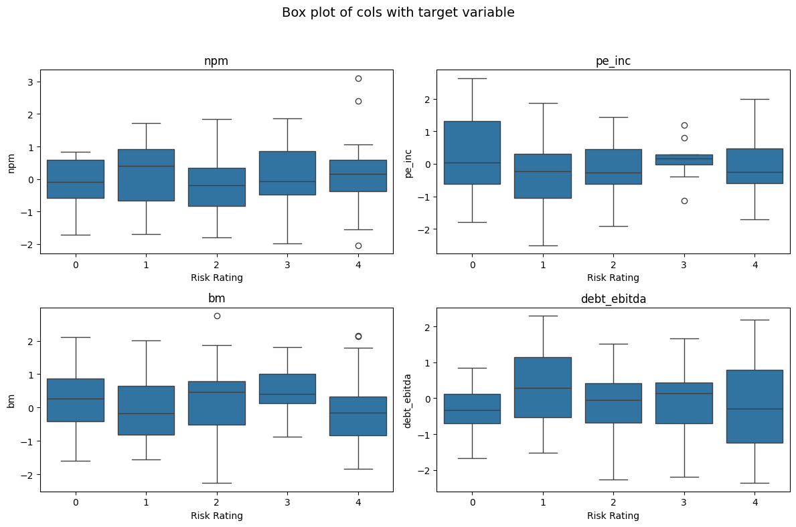
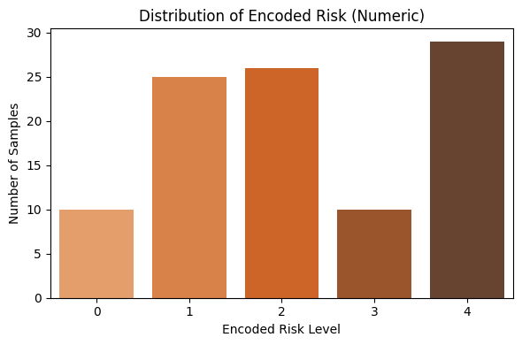
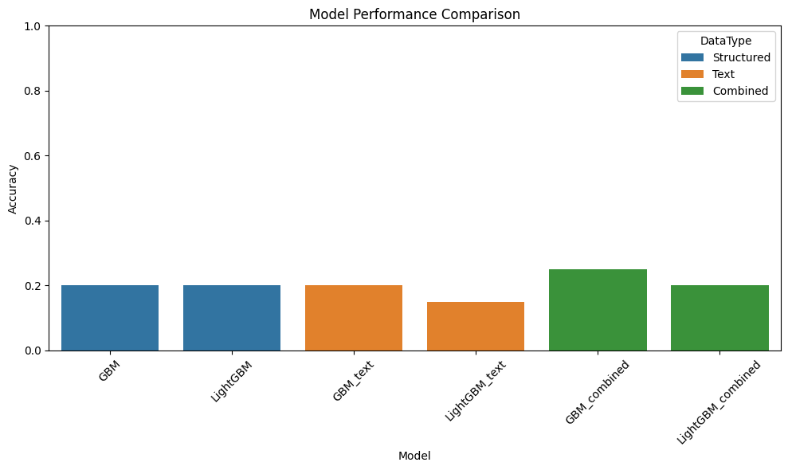
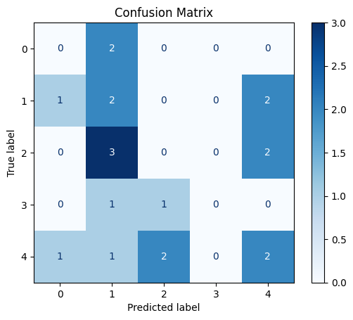
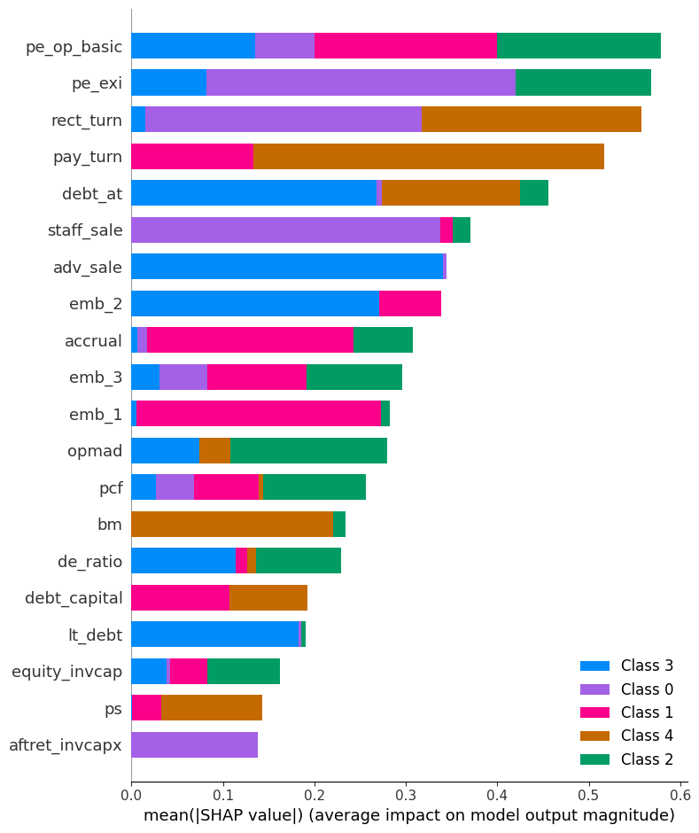

## Credit Rating Prediction using Structured and Text Data
A machine learning method for predicting credit ratings using structured financial indicators and textual analysis of earnings call.

## Quick Overview:

Before I begin the analysis of the data, I would like to highlights important points and observations based on preliminary glance:
1. The goal of the exercise is to predict and explain the ratings and therefore, I have selected ‘Rating’ as target variable. Based on this goal, domain knowledge and feature selection methods, I have selected the features for training the model. 
2. The data set has only 100 samples. Because the training and test dataset will be very small, the analysis may not reflect the correct results. 
3. The dataset has high dimension (154 columns). 1 column is categorical(Rating Type), 1 column is earnings call excerpts and the remaining columns are numerical with data spanning, macro, financials, bonds etc.
4. Therefore, feature selection is important for such high dimensional data before we prepare the model to train and test.
5. I would like to highlight one important consideration as per the data:
    -  The ‘RATING_TYPE’ and ‘Rating’ variable are important variables for deciding the target variable
    -  ‘RATING_TYPE’ variable gives information about the ‘Rating Agency’. The three agencies here are: S&P, Moody’s and Fitch. 
    -  In general, the rating classification of these three agencies are different and therefore if we take ‘Rating’ as the target              variable, it will ignore the subjectivity introduced by the ‘RATING_TYPE’ variable.
    -  We can create a matrix of three rating agencies which maps the rating of each agencies to the level of Risk.

## Credit Rating Scale Comparison

| Moody's | Standard & Poor's | Fitch        | Grade       | Risk            |
|---------|-------------------|--------------|-------------|------------------|
| Aaa     | AAA               | AAA          | Investment  | Lowest Risk      |
| Aa      | AA                | AA           | Investment  | Low Risk         |
| A       | A                 | A            | Investment  | Low Risk         |
| Baa     | BBB               | BBB          | Investment  | Medium Risk      |
| Ba, B   | BB, B             | BB, B        | Junk        | High Risk        |
| Caa/Ca  | CCC/CC/C          | CCC/CC/C     | Junk        | Highest Risk     |
| C       | D                 | D            | Junk        | In Default       |


## Project Overview

This project builds a predictive model for credit ratings using both structured (financial ratios) and unstructured (textual) data. 
Two machine learning methods for classification are used: Gradient Boosting, LightGBM.
These models are useful for capturing the complex reelationships between the explantory variable and the target variable. Based on analysing the relationships between financial indicators(explantory variables) and the target variable, it was seen that the explantory variables were not depicting the monotonic linear relationships.

## Dataset

- 100 companies
- 151 financial features
- 1 text column containing one liners from earnings call exercepts.
- Target: Ordinal credit rating from AAA to BB converted to numeric rating(0-4) based on risk mapping.


## Modeling Approach
- EDA Analysis- The data was fairly small and the scale of the variables were pre-processed with no missing values
  and major outliers. There was no high correlation b/w the variables and therefore the impact of multi-collinearity was ignored.
- Structured Data: Feature selection based on domain knowledge and target variable. We selected financial ratios as feature variables as   we chose 'Rating' as the target variable.
- Text Data: For the text data, it had just five unique values and positive sentiment for all the texts. Since there was no variation in it, we chose to convert them into SentenceTransformer embeddings to undestand the context and then did PCA to reduce the dimension from 364 to 10 for using them in the model.
- NLP: By using @https://huggingface.co/distilbert/distilbert-base-uncased-finetuned-sst-2-english model, I have tried calculating the sentiment label and score, it doesn't have significant variation, therefore, sentiment analysis is not used in prediction.
- Transformers based embeddings: Used small model 'all-MiniLM-L6-v2' to calculated the embeddings of the text.
- Model: Gradient Boosting (GBM) for classification of credit ratings based on Structured + Text features.
- Evaluation: Accuracy, Weighted Accuracy, SHAP for each class for interpretability.

  # Key Findings and Highlights

  ## Realtionship of few explantory variables with Target Variable
  - The explantory variables didn't exhibit monotonic linear relationships and therefore, tree models were used for modelling to capture complex relationships. Net profit margin for example, first decrease with increasing risk and then increases. debt_ebditda as well don't follow any monotonic relationship
  - 
  
  ## Distribution of credit ratings after converting them to numeric values
  - The credit ratings were mapped to numeric rating as per the risk level mapping. The distibution is not completely symmetric and since the rows are just 100, it doesn't require any majorintervention.
  
  
  ## Model Performance based on Structured only, text only and combined data
  - GBM accuracy went from 0.2 to 0.25 after incorporating the text data suggesting that the model has captured the context well enough using text embeddings
  

  ## Multi-Class Confusion matrix
  - Given that the data size was just 100, test data of 20 samples, the confusion matrix shows the prediction model could not be trained sufficiently well and therefore faces issues in prediction for test data.
  

  ## Shap Values for Interpretability
  - The shap values for each class depicts that leverage ratios, profitability ratios and also embedding features of text are contributing to the prediction of the ratings. Given that the data is not large enough, these values may not reflect the real impact of the features if the data would haev been large.
  

  ## Final Recommendation
  The financial features along with the text data which reflects the sentiment/context of the data may help to improve the prediction modelling of the credit rating data. Those kind of unstructured data (like earning calls transcripts) may give good signals for it to be used in the modelling. The financial indicators like
  - Leverage ratios: de_ratio, debt_capital
  - Profitability  ratios: roa, roce, npm
  - Repayment capability: cashflow margin, cash_debt
    are contributing to the prediction of the ratings along side text features in the form of embeddings like emb_1, emd_3 etc. 

## Running the Notebook Locally

To run the notebook on your local machine:

Clone this repository:
```bash
git clone https://github.com/yourusername/your-repo-name.git](https://github.com/rajat14/ml-credit_rating.git
cd ml-credit_rating
```

## Note
AI was used only for small code cleanups and grammar fixes. All analysis and modeling were done manually and independently by me.
  
  


